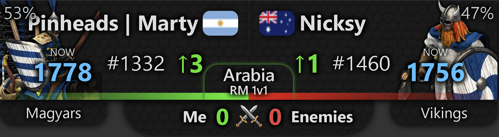

# AOE2 Player Overlay

This is a live overlay for Age of Empires 2 that displays real-time match information for a specified player.

## Usage

To use the overlay, host it on a web server and access it via URL with the following parameters:

-   `profile_id`: The player's profile ID (required). This is the numeric ID of the AOE2 player you want to track.
-   `compact`: Optional. If present or set to "true", enables compact mode with a smaller overlay size.
-   `match_counter`: Optional. If present, displays a match counter below the overlay showing wins and losses.

### Example URLs

-   With match counter: `https://lucasjappert.github.io/new-aoe-overlay-public/?profile_id=123456&match_counter`

-   Compact mode: `https://lucasjappert.github.io/new-aoe-overlay-public/?profile_id=123456&compact`

-   Basic usage: `https://lucasjappert.github.io/new-aoe-overlay-public/?profile_id=123456`

## Contributing

We love Age of Empires 2! If you'd like to cooperate on the project, contact me on Discord: Marty#1533.
